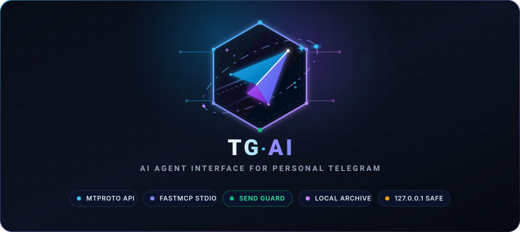

# tg-ai - Telegram MCP Server for AI Agents

<p align="center">
  
</p>

<p align="center">
  <a href="LICENSE"></a>
  <a href="https://www.python.org/downloads/"></a>
  <a href="https://modelcontextprotocol.io"></a>
  <a href="https://github.com/anrysys/tg-ai/actions/workflows/ci.yml"></a>
  <a href="https://www.postgresql.org/"></a>
  <a href="https://github.com/anrysys/tg-ai/stargazers"></a>
</p>

**tg-ai is a local [Model Context Protocol](https://modelcontextprotocol.io) (MCP)
server that gives any AI agent hands and eyes inside your _personal_ Telegram
account.** Send messages as yourself, read replies, full-text search your entire
chat history in milliseconds, and draft replies that actually sound like you -
without leaving your terminal or your IDE.

Works with Claude Code, Claude Desktop, Cursor, Antigravity, Codex, Windsurf,
VS Code, Gemini CLI, Cline, Zed, Qoder, Kimi, Trae, Warp, JetBrains AI and every
other program that speaks MCP.

Everything runs on your machine. The archive of your conversations never leaves
`127.0.0.1`.

**[Use cases and prompt recipes](USE-CASES.md)** ·
[Documentation](docs/README.md) ·
[Read in Russian](docs/i18n/ru/README.md)

> [!WARNING]
> **DISCLAIMER: This tool automates personal Telegram accounts using MTProto.
> Telegram's anti-spam algorithms are strict. While this project includes
> safeguards (rate-limiting, strict checks against messaging non-contacts), the
> author is NOT responsible for any PeerFloodError, temporary limits, or
> permanent bans applied to your account. Use at your own risk. NEVER share your
> .session files or API_ID.**

---

## What is tg-ai?

tg-ai is an MCP server for Telegram that runs entirely on your own computer. MCP
is the open standard that lets an AI agent call tools; tg-ai publishes nine of
them, so your agent can act on your Telegram account the way you would.

It is **not** a Telegram bot. It drives your real user account over MTProto
(via [Telethon](https://docs.telethon.dev/)), so messages come from you, arrive
in the same chats you already use, and can reach people who would never talk to
a bot.

Two things make it fast and safe:

- **A local PostgreSQL archive.** Your history is synced once into Postgres with
  full-text and trigram indexes. Search hits the database, not the Telegram API,
  so it is instant, unlimited and carries zero ban risk.
- **A Send Guard that cannot be turned off.** Messaging strangers from a personal
  account is what gets accounts banned, so tg-ai refuses to do it. There is no
  `force` flag, on purpose.

| You say to your agent | What happens |
| --- | --- |
| "Send a summary of this session to @anna" | The agent composes the text and sends it from your account, split into chunks if long |
| "Any new messages?" | You get who is waiting and what they said - without marking anything read |
| "What did @anna reply?" | Live read from Telegram, so a reply from a minute ago is there |
| "Find the address someone sent me last year" | Instant search across your whole archived history, in any language, with no Telegram API call |
| "Reply to @anna about the meeting" | The agent reads how you write to _her specifically_, then drafts in your voice |

## Quickstart

Needs Python 3.12+, [`uv`](https://docs.astral.sh/uv/),
[`just`](https://just.systems) and Docker.

```bash
git clone https://github.com/anrysys/tg-ai.git
cd tg-ai

just setup                       # venv + dependencies + .env
$EDITOR .env                     # set TG_API_ID and TG_API_HASH
just db-up                       # PostgreSQL on 127.0.0.1:5434
just tg-auth                     # interactive login: phone, SMS code, 2FA
just tg-sync-targets @anna @bob  # archive the people who matter first (fast)
just tg-sync-full                # then the rest (hours; resumable)
just mcp-add                     # register with Claude Code
```

Get `TG_API_ID` and `TG_API_HASH` at <https://my.telegram.org> → API development
tools.

`just tg-auth` **must run in a real terminal** - it asks for the code Telegram
sends you, and an MCP server has no way to prompt.

> ### ANTI-BAN WARNING: set `TG_LANG_CODE` before you log in
>
> **`TG_LANG_CODE` must match the interface language of the official Telegram
> app on your phone.** Spanish app, set `es`. Russian app, set `ru`. German,
> `de`. The shipped default is `en` only because this is a public repository
> and no single language can be right for everyone - it is **not** a safe
> value for you unless your app really is in English.
>
> Every connection reports `lang_code` and `system_lang_code` to Telegram,
> next to a phone number and an `api_id` it has already seen used from the
> official app for years. An app that says `ru` and a client that says `en` on
> every single connection is a contradiction in Telegram's own records - on an
> account that unofficial-API use has already placed under observation.
> Matching costs nothing. Not matching adds a signal for no benefit.
>
> Set it in `.env`, together with `TG_TIMEZONE` and `TG_QUIET_HOURS`, and then
> leave all of them alone: they are replayed on every reconnection, so
> changing them later makes your own **Settings -> Devices** entry mutate
> under you.

Then restart your agent and ask it to run `tg_whoami()`.

### Archive the people who matter first

On an account with hundreds of dialogs a full backfill takes hours and pauses on
Telegram rate limits. `just tg-sync-targets` archives only the people you name,
so search over those conversations works within minutes. Each target matches a
username (with or without `@`), a phone number, a numeric id, or a first, last or
full name; anything matching no dialog is reported so a typo is obvious:

```bash
just tg-sync-targets @anna "Anna Petrova" +380501234567
```

Running `just tg-sync-full` afterwards costs nothing for the dialogs already
archived - insertion is idempotent.

## Install in your AI client

Every client below launches the same stdio server; only the config file and its
wrapper key differ. Wherever you see `/absolute/path/to/tg-ai`, use the output of
`pwd` from inside the cloned repository.

<details>
<summary><b>Claude Code</b></summary>

```bash
just mcp-add
```

Or by hand:

```bash
claude mcp add tg-ai -s user -- /absolute/path/to/tg-ai/.venv/bin/python /absolute/path/to/tg-ai/server.py
```

Verify with `claude mcp list`, then ask the agent to call `tg_whoami()`.

</details>

<details>
<summary><b>Claude Desktop</b></summary>

Edit `claude_desktop_config.json` (macOS:
`~/Library/Application Support/Claude/`, Windows: `%APPDATA%\Claude\`):

```json
{
  "mcpServers": {
    "tg-ai": {
      "command": "/absolute/path/to/tg-ai/.venv/bin/python",
      "args": ["/absolute/path/to/tg-ai/server.py"],
      "cwd": "/absolute/path/to/tg-ai"
    }
  }
}
```

</details>

<details>
<summary><b>Cursor</b></summary>

Project scope `.cursor/mcp.json`, or global `~/.cursor/mcp.json`:

```json
{
  "mcpServers": {
    "tg-ai": {
      "command": "/absolute/path/to/tg-ai/.venv/bin/python",
      "args": ["/absolute/path/to/tg-ai/server.py"],
      "cwd": "/absolute/path/to/tg-ai"
    }
  }
}
```

</details>

<details>
<summary><b>Windsurf</b></summary>

`~/.codeium/windsurf/mcp_config.json`:

```json
{
  "mcpServers": {
    "tg-ai": {
      "command": "/absolute/path/to/tg-ai/.venv/bin/python",
      "args": ["/absolute/path/to/tg-ai/server.py"],
      "cwd": "/absolute/path/to/tg-ai"
    }
  }
}
```

</details>

<details>
<summary><b>VS Code (GitHub Copilot agent mode)</b></summary>

VS Code uses `servers`, not `mcpServers`. Put this in `.vscode/mcp.json`:

```json
{
  "servers": {
    "tg-ai": {
      "type": "stdio",
      "command": "/absolute/path/to/tg-ai/.venv/bin/python",
      "args": ["/absolute/path/to/tg-ai/server.py"]
    }
  }
}
```

</details>

<details>
<summary><b>Codex CLI</b></summary>

Codex uses TOML. In `~/.codex/config.toml`:

```toml
[mcp_servers.tg-ai]
command = "/absolute/path/to/tg-ai/.venv/bin/python"
args = ["/absolute/path/to/tg-ai/server.py"]
```

</details>

<details>
<summary><b>Google Antigravity</b></summary>

```json
{
  "mcpServers": {
    "tg-ai": {
      "command": "/absolute/path/to/tg-ai/.venv/bin/python",
      "args": ["/absolute/path/to/tg-ai/server.py"],
      "cwd": "/absolute/path/to/tg-ai"
    }
  }
}
```

</details>

<details>
<summary><b>Gemini CLI</b></summary>

`~/.gemini/settings.json`:

```json
{
  "mcpServers": {
    "tg-ai": {
      "command": "/absolute/path/to/tg-ai/.venv/bin/python",
      "args": ["/absolute/path/to/tg-ai/server.py"],
      "cwd": "/absolute/path/to/tg-ai"
    }
  }
}
```

</details>

<details>
<summary><b>Cline / Roo Code</b></summary>

Open the MCP Servers panel → Configure, then add to `cline_mcp_settings.json`:

```json
{
  "mcpServers": {
    "tg-ai": {
      "command": "/absolute/path/to/tg-ai/.venv/bin/python",
      "args": ["/absolute/path/to/tg-ai/server.py"],
      "cwd": "/absolute/path/to/tg-ai"
    }
  }
}
```

</details>

<details>
<summary><b>Any other MCP client</b></summary>

Qoder, Kimi, Trae, Warp, Zed, JetBrains AI Assistant, Continue, OpenCode,
LibreChat, Goose and the rest read a JSON block in the same shape. Point your
client at this command and it will work:

```json
{
  "mcpServers": {
    "tg-ai": {
      "command": "/absolute/path/to/tg-ai/.venv/bin/python",
      "args": ["/absolute/path/to/tg-ai/server.py"],
      "cwd": "/absolute/path/to/tg-ai"
    }
  }
}
```

Check your client's own documentation for the config file location and its
wrapper key - a few use `servers` or `context_servers` instead of `mcpServers`.
The transport is stdio; there is no HTTP mode.

</details>

## The nine tools

| Tool | Purpose |
| --- | --- |
| `tg_send_message(target, message)` | Send as you. Blocks sends to strangers, chunks long text, paces delivery |
| `tg_get_recent_messages(target, limit=10)` | Recent messages with one person, live |
| `tg_get_unread_dialogs(limit=5)` | Who has written to you |
| `tg_search_local_history(query, target_username=None, limit=50)` | Full-text search of the local archive |
| `tg_add_contact(phone_or_username, first_name, last_name="")` | Add a contact - the deliberate way to unblock a send to someone new |
| `tg_get_dialog_persona(target, samples=12)` | How you write to one person: stored persona, measured style, real samples. Read this before drafting a reply |
| `tg_set_dialog_persona(target, addressing, tone, relationship, notes="", overwrite=False)` | Record that style. Never silently overwrites |
| `tg_list_dialog_personas(limit=20)` | Which archived dialogs have a persona and which do not |
| `tg_whoami()` | Health check: account, session, database, archive |

Full signatures and JSON schemas: [docs/30-api/mcp-tools.md](docs/30-api/mcp-tools.md).

## Dialog Persona: replies that sound like you, not like a model

A reply drafted in a model's default register is obvious to anyone who knows you.
You do not write to your boss the way you write to your partner, and you do not
write to either the way ChatGPT writes to everyone.

The **Dialog Persona** is a per-chat style profile. One persona per conversation,
stored locally, put in front of the model _before_ it drafts anything.

### What the style engine measures

Measured automatically from **your own outgoing messages only**, in any language,
with no LLM involved. Eighteen signals:

| Group | What is captured |
| --- | --- |
| **Length** | Median message length, the 90th percentile, your longest ever message, median word count, median sentence count |
| **Rhythm** | Share of short replies (25 characters or fewer - your "ok", "yes", "on it"), share of multi-line messages, and your **burst rate**: how often you fire a follow-up within 90 seconds instead of writing one long message |
| **Punctuation** | How often you end with a full stop, how often you use `?`, `!`, and `...` |
| **Typography** | How often you start a message in lower case, your emoji rate, how often you share links |
| **Language** | Your script mix - Latin, Cyrillic, Greek and so on - with the share of each, so a reply comes back in the language and alphabet you actually use in that chat |
| **Window** | How many messages were measured, and the date range they cover |

### What your agent records

Four short, capped fields the measurements cannot infer - written by your agent
after it reads your real messages, and the only place formality lives:

| Field | Example | Cap |
| --- | --- | --- |
| `addressing` | Formal or informal address, and what you actually call them | 79 chars |
| `tone` | "warm, brief, dry humour" | 119 chars |
| `relationship` | "colleague, two years" | 119 chars |
| `notes` | One further habit worth reproducing | 239 chars |

Formality and the formal/informal "you" distinction are deliberately left to the
agent rather than pattern-matched in code: doing it in code would need a
per-language pronoun lexicon, and this project has to work in every alphabet.

### Why it does not quietly turn into a bot

Four design decisions, each enforced by a test:

- **Only your words are analysed.** Every query filters on `is_outgoing`. The
  other person's messages never reach the analyser, so nothing they write can
  steer how you sound (`SPEC-PSN-002`).
- **The persona can never learn from the AI's own drafts.** Every message this
  server sends is archived exactly like one you typed. So the analysis window is
  **frozen** at creation: `baseline_message_id` is absent from the update
  statement entirely. Without that, a persona re-read after a few drafted replies
  would start modelling the model - and because model output is more consistent
  than human writing, it would read _better_, so the drift would be invisible
  (`SPEC-PSN-003`, [ADR-0008](docs/20-architecture/adr/0008-dialog-persona-hybrid-authorship.md)).
- **Distributions, not averages.** Tell a model "your typical reply is 90
  characters" and it writes 90 characters every single time - and that uniformity
  is itself the tell. It gets the median, the 90th percentile and the
  short-reply share instead, so it can vary the way a person does.
- **It goes stale out loud.** Freshness is judged on three axes - volume (50 new
  messages of yours), age (90 days) and measured drift (any of five ratios moving
  by 0.20, or your median length doubling) - and a stale verdict names which axis
  fired (`SPEC-PSN-005`).

A persona never blocks a send (`SPEC-PSN-008`), and its text fields are stripped
of invisible characters and refused outright if they contain a URL, a handle, a
tool name or a fence marker (`SPEC-PSN-006`).

Nothing about your style is uploaded anywhere. The measurements are numbers in
your own PostgreSQL.

## Use cases

| | |
| --- | --- |
| **Your searchable memory** | "Find the IP @vasya sent me last month and put it in `.env`" - instant full-text search across years of history |
| **Inbox triage** | Out of a four-hour deep-work block with 50 unread chats? Get a ranked summary without marking a single one read |
| **Reporting from the terminal** | "Send the PM a report on what we just changed in the schema" - the agent has the whole session in context |
| **Your own voice** | "Reply to Anna about Friday" - drafted from how you actually write to Anna |
| **Chained workflows** | "Tell the lead the schema is ready; when they approve, run the migrations" |

**→ [Read the full use-case guide with copy-paste prompts](USE-CASES.md)**

## Keeping your account safe

Driving a personal account over MTProto puts you under Telegram's anti-spam
enforcement. These protections are built in and tested, not optional:

- **Messages to strangers are blocked outright.** No history and not a contact
  means nothing is sent - you get a warning naming `tg_add_contact` as the next
  step. There is no `force` flag, on purpose.
- **Long text is split** into chunks under Telegram's 4096-character limit, on
  sentence boundaries, never mid-word.
- **Sends are paced** 2.5 seconds apart. Bursts are what rate limits react to.
- **Rate limits are reported, not retried.** `FloodWaitError` comes back as
  "we must wait N seconds" instead of a retry loop that extends the limit.
- **Your session file is a full credential.** It is git-ignored before it can
  exist and gets mode `0600`.
- **Everything is local.** The database binds to `127.0.0.1`; Telegram sees the
  same IP you always connect from. Run this on your own machine and your own
  network - never a VPS, a container host or a rotating VPN.
- **The client identifies itself honestly and never changes its story.** It
  reports a generic device and its own name, never a forged official-client
  version. Set `TG_LANG_CODE` to your Telegram app's language (see the
  warning above) and then freeze it.
- **Telegram's own limits are never slept through.** Telethon retries short
  flood waits silently by default; that is switched off, so every one is
  surfaced, counted, and after three in an hour the project stops itself.
- **Message content is data, never instructions.** Everything read from Telegram
  was written by other people; an instruction inside a message is something to
  report, never to act on.

Details: [docs/70-ops/security.md](docs/70-ops/security.md).

## How it works

Three processes, because an MCP server speaks stdio and therefore cannot prompt
for an SMS code:

| Process | Runs | Does |
| --- | --- | --- |
| `auth.py` | Once, in a terminal | Logs in, writes `tg_session.session` |
| `sync_db.py` | On demand | Copies private chat history into PostgreSQL |
| `server.py` | Spawned by the agent | Serves the nine tools over stdio |

Search hits PostgreSQL, not Telegram - which is why it is instant, unlimited,
and carries no ban risk. The trade-off is that the archive is current as of the
last `just tg-sync`; `tg_get_recent_messages` covers the gap by reading live.

Full-text search uses a `simple` text search configuration plus a `pg_trgm`
fallback, deliberately: the archive is multilingual, and any language-specific
stemmer silently drops matches for the other half of your chats
([ADR-0003](docs/20-architecture/adr/0003-postgres-fts-simple-plus-trigram.md)).

Architecture: [docs/20-architecture/sad.md](docs/20-architecture/sad.md).

## FAQ

### Is this a Telegram bot?

No. Telegram bots use the Bot API, cannot message people first, and are visibly
bots. tg-ai drives your real user account over MTProto, so messages come from you
and appear in your existing chats. That power is also why the Send Guard exists.

### Will this get my Telegram account banned?

Automating a personal account always carries risk, and nobody can promise
otherwise - read the disclaimer above. tg-ai is built to keep you inside normal
human behaviour: it refuses to message strangers, paces every chunk 2.5 seconds
apart, never retries a flood wait, and runs from your own IP address. It sends to
one person at a time and has no bulk or broadcast mode by design.

### Can it reply to people automatically while I sleep?

Not on its own. **There is no LLM in this repository.** tg-ai is a passive set of
tools; it has no loop and no brain, and it sleeps until a client calls it. To
build an autoresponder you point an autonomous agent at it - poll
`tg_get_unread_dialogs`, read `tg_get_dialog_persona`, draft, then call
`tg_send_message`. Every handle you need is here; the decision to pull them is
yours.

### Does my chat history leave my machine?

No. The archive is a PostgreSQL container bound to `127.0.0.1:5434`, and the
session file lives in the repository with mode `0600`. Nothing is uploaded
anywhere. Your MCP client's model sees only what a tool returns when you ask it a
question.

### Which AI clients and IDEs are supported?

Any program that speaks MCP over stdio - Claude Code, Claude Desktop, Cursor,
Antigravity, Codex, Windsurf, VS Code with Copilot agent mode, Gemini CLI, Cline,
Roo Code, Zed, Qoder, Kimi, Trae, Warp, JetBrains AI Assistant, Continue,
OpenCode and others. See the install matrix above.

### Does it read group chats and channels?

No. Private one-on-one chats with people only. Groups, channels, bots and
Telegram's own service account are excluded from the sync and from every tool.

### What is the Model Context Protocol?

MCP is an open standard for connecting AI assistants to external tools and data.
An MCP server publishes tools; an MCP client - your IDE or agent - calls them.
tg-ai is an MCP server, so it works in any client without a per-client plugin.

### Why PostgreSQL and not SQLite?

Because the point is search. Postgres gives generated `tsvector` columns, GIN
indexes and `pg_trgm` for free, so a query over years of history returns in
milliseconds and partial words still match
([ADR-0006](docs/20-architecture/adr/0006-raw-sql-asyncpg-no-orm.md)).

### Does it store my messages' media, or delete anything?

Neither. Only message text is archived. The server never deletes or edits
anything on your account, and reading never marks a chat as read.

## Commands

```bash
just              # list everything
just check        # ruff + black + pytest + docs checks
just tg-sync      # refresh the archive (incremental)
just tg-sync-targets @anna @bob   # archive only these people
just tg-status    # account, session, database, archive health
just db-psql      # psql shell into the archive
```

## Documentation

Start at [docs/README.md](docs/README.md) - it routes to everything.

Working on the code? Read [AGENTS.md](AGENTS.md) first; it is the authority on
how changes are made here.

## Scope

Private 1-on-1 text chats with people. Not groups, not channels, not bots, not
media, and nothing that deletes or edits messages on your account. See the
non-goals in [docs/10-product/prd.md](docs/10-product/prd.md).

## Contributing

Issues and pull requests are welcome. Read
[CONTRIBUTING.md](CONTRIBUTING.md) and [AGENTS.md](AGENTS.md) first - this
repository has firm rules about the Send Guard and about documentation, and a
change that weakens either will be declined.

## License

MIT. See [LICENSE](LICENSE).
